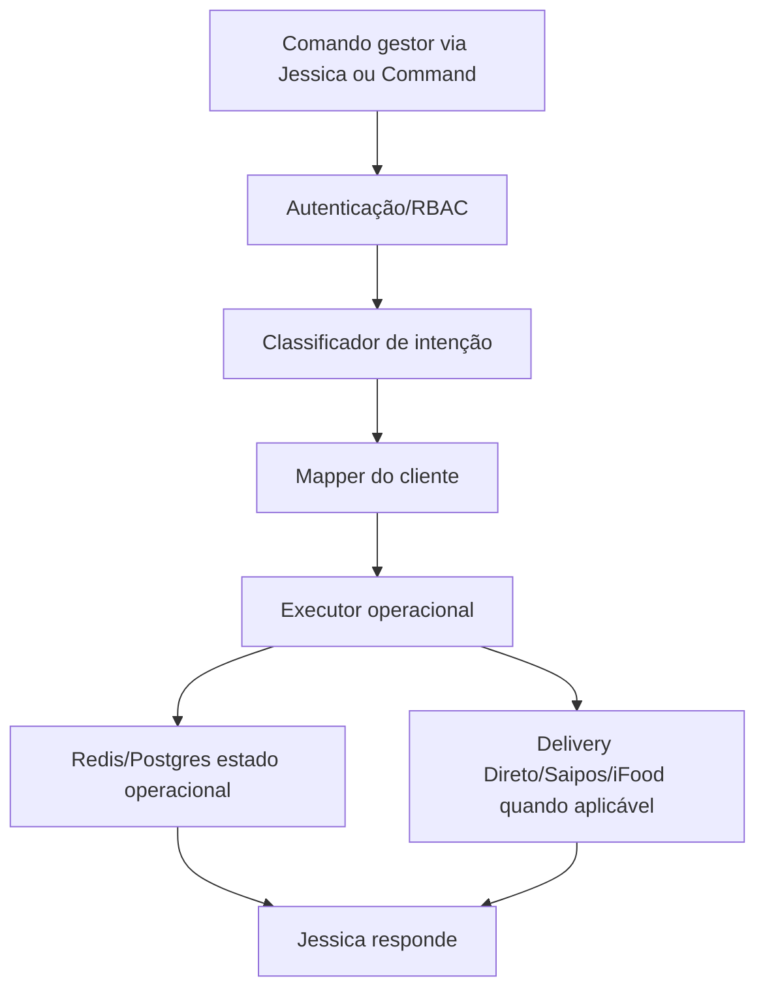

# Gestão Operacional v5 — briefing antes da consolidação

Data: 2026-06-23  
Autor: Codex  
Público: Thiago, Tassiano e Claude

## Por que não consolidar ainda

Hoje existem fluxos de gestão operacional v3, v4 e v5. A v5 é a melhor base, mas ainda carrega decisões de protótipo:

- Premium hardcoded.
- Sabores, bebidas, códigos e ingredientes escritos dentro de Code node.
- Gestores autorizados escritos dentro do workflow.
- Webhook sem autenticação própria forte.
- Estados salvos em Redis por chave específica.

Se consolidarmos agora sem conversar, vamos só trocar uma gambiarra por outra mais bonita.

## O que a v5 já faz

### Comandos de pausa por ingrediente

Exemplo:

```txt
Acabou catupiry
```

Resultado esperado:

- identificar sabores que usam catupiry;
- marcar todos como `EM_FALTA`;
- salvar estado no Redis;
- retornar mensagem para Jessica.

### Comandos com “apenas”

Exemplo:

```txt
Apenas a Calabresa está em falta
```

Resultado esperado:

- pausar somente a opção Calabresa.

### Liberação

Exemplo:

```txt
Liberar catupiry
```

Resultado esperado:

- liberar todos os itens pausados por aquele ingrediente.

### Estados atuais

- Sabores: `ATIVO`, `EM_FALTA`, `OCULTO`.
- Bordas/adicionais: intenção parecida, mas ainda precisa mapear melhor.
- Bebidas: tende a `ATIVO` ou `OCULTO`.

## O que a v4 fazia melhor

A v4 tinha comandos operacionais mais amplos:

- pausar loja/pedidos;
- retomar loja;
- alterar prazo de entrega;
- alterar prazo de retirada;
- pausar item no Delivery Direto;
- cadastrar usuário operacional;
- salvar overrides em Redis.

Por isso, consolidar v5 não deve significar jogar fora v4. A consolidação correta é:

```txt
v5 = motor principal de interpretação por ingrediente/item
v4 = biblioteca de intenções operacionais úteis
Command/Mapper = fonte oficial dos dados
```

## Como deveria ficar no SaaS



## Fonte dos dados

Nada deve ficar fixo no workflow:

- sabores;
- ingredientes;
- bordas;
- adicionais;
- bebidas;
- setores;
- gestores;
- permissões;
- códigos PDV;
- regras do cliente.

Tudo deve vir de:

- Mapper;
- banco Postgres;
- Command Center;
- configurações por tenant.

## Decisões para Thiago e Tassiano

Antes de eu consolidar, precisamos decidir:

1. Quem pode pausar/liberar item?
2. Quem pode pausar loja inteira?
3. Quem pode alterar prazo?
4. Pausa por ingrediente deve afetar bordas, pizzas, adicionais e produção?
5. Bebida em falta deve ser `OCULTO` ou `EM_FALTA` visual?
6. Pausa deve ter expiração automática ou exigir confirmação humana?
7. Todo comando via Jessica deve pedir confirmação antes de executar?
8. Command pode executar direto ou deve gerar ação pendente?
9. Quais ações precisam auditoria obrigatória?
10. Quais ações podem ser reversíveis com “desfazer”?

## Recomendação Codex

### Camada 1 — Intenções

Criar lista oficial:

- `PAUSAR_ITEM`
- `LIBERAR_ITEM`
- `PAUSAR_INGREDIENTE`
- `LIBERAR_INGREDIENTE`
- `PAUSAR_LOJA`
- `RETOMAR_LOJA`
- `ALTERAR_PRAZO_ENTREGA`
- `ALTERAR_PRAZO_RETIRADA`
- `CADASTRAR_USUARIO`
- `CONSULTAR_ESTADO_OPERACIONAL`

### Camada 2 — Permissões

Cada intenção exige permissão:

- `operacao:item:editar`
- `operacao:loja:pausar`
- `operacao:prazo:editar`
- `usuarios:criar`
- `command:aprovar_acao`

### Camada 3 — Prévia antes de executar

Para comandos destrutivos ou amplos:

```txt
“Encontrei 12 sabores com catupiry. Quer pausar todos agora?”
```

Executa só depois de:

```txt
Confirmo
```

### Camada 4 — Auditoria

Registrar:

- quem pediu;
- canal;
- texto original;
- intenção detectada;
- itens afetados;
- antes/depois;
- horário;
- workflow/agente responsável;
- rollback possível.

## Plano técnico de consolidação

1. Congelar v3 como deprecated e não chamar mais.
2. Extrair intenções úteis da v4.
3. Manter v5 como base, mas remover hardcode.
4. Criar endpoint único:

```txt
/webhook/khardela/gestao-operacional
```

5. Criar autenticação interna por assinatura/API key.
6. Buscar cardápio/mapper no Postgres/Command.
7. Retornar prévia para ações amplas.
8. Executar com confirmação.
9. Registrar auditoria no Command.
10. Desativar v3/v4 após validação.

## O que conversar com o Claude

Pergunta principal:

```txt
Como transformar a gestão operacional em produto multi-cliente sem deixar regra da Premium fixa dentro do workflow?
```

Perguntas de apoio:

- Como representar ingredientes compartilhados entre setores?
- Como pausar item que aparece em múltiplos canais?
- Como mostrar impacto antes de executar?
- Como versionar alteração operacional?
- Como permitir rollback?

## Resultado esperado

Após a consolidação, a Jessica deve conseguir operar como uma funcionária real:

- entende comando natural;
- mostra impacto;
- pede confirmação quando necessário;
- executa;
- audita;
- responde de forma humana;
- mantém o Command como fonte de verdade.
