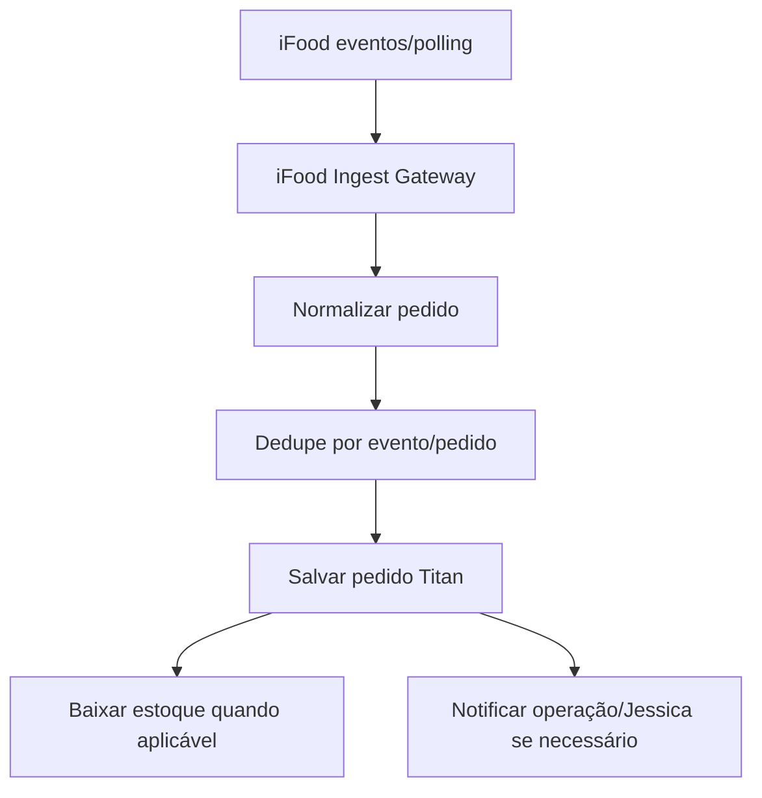

# iFood — planejamento de integração

Data: 2026-06-23  
Autor: Codex  
Escopo: criar fluxo novo após correções n8n/Saipos/Jessica

## Objetivo

Receber pedidos iFood dentro da plataforma Titan sem misturar responsabilidades com o fluxo Saipos atual.

## Princípio

iFood deve entrar como fonte de pedido, não como gambiarra dentro da Jessica.

Fluxo desejado:



## Módulos necessários

### 1. Autenticação

- Criar app no iFood Developer.
- Configurar client id/client secret.
- Guardar segredo em variável/credencial segura.
- Renovar token automaticamente.

### 2. Ingestão de eventos

Início recomendado:

- Polling controlado, por ser mais previsível para homologação.

Depois:

- Webhook para menor latência.
- Manter polling de reconciliação mesmo com webhook.

### 3. Dedupe

Chaves sugeridas:

```txt
ifood:event:{event_id}
ifood:pedido:{order_id}
```

### 4. Normalização

Converter pedido iFood para formato interno Titan:

- cliente;
- telefone quando disponível;
- itens;
- complementos;
- taxas;
- descontos;
- método de entrega;
- status;
- timestamps;
- origem `IFOOD`.

### 5. Status e reconciliação

Guardar histórico:

- pedido recebido;
- confirmado;
- em preparo;
- saiu para entrega;
- concluído;
- cancelado.

### 6. Estoque

Somente baixar estoque depois de:

- pedido aceito/confirmado conforme regra operacional;
- ficha técnica mapeada;
- dedupe validado.

## Ordem recomendada

1. Criar credenciais iFood seguras.
2. Criar workflow dev `DEV - Titan - iFood Auth Test`.
3. Criar workflow dev `DEV - Titan - iFood Events Poll`.
4. Normalizar 3 pedidos reais/sandbox para JSON Titan.
5. Criar tabela/registro de eventos.
6. Integrar com API própria de pedidos.
7. Depois transformar em produção.

## Fora do escopo por enquanto

- Publicar cardápio no iFood.
- Gestão completa de catálogo iFood.
- Automação de campanhas.

Esses passos vêm depois de receber pedido com segurança.
