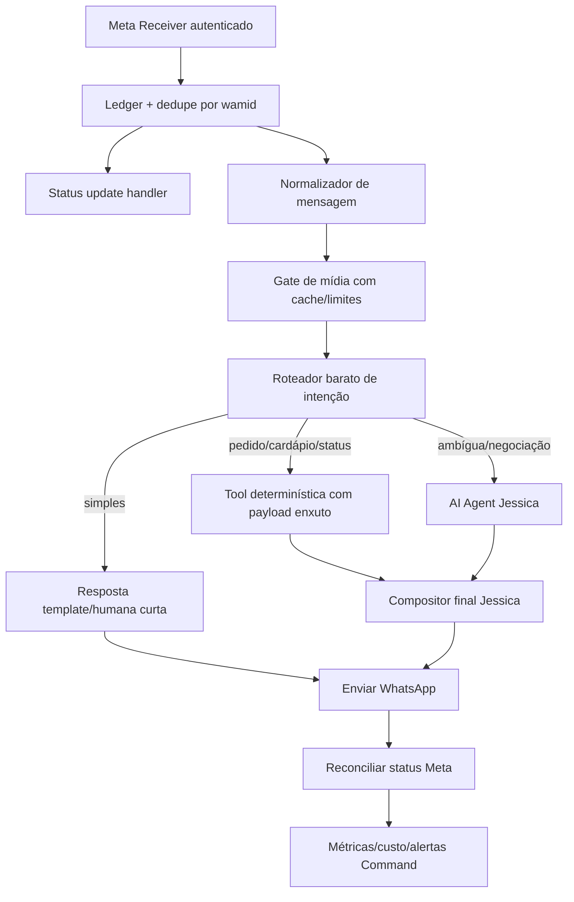

# Auditoria n8n/Jessica — 2026-06-23

Status: diagnóstico inicial concluído pelo Codex; Health Check corrigido e validado em 2026-06-23  
Escopo: workflows ativos do n8n relacionados ao Titan Khardela, Jessica, Meta, Delivery Direto, Saipos, estoque e rotinas operacionais.

## Regra de segurança

- Nenhum token, senha, webhook secreto ou chave foi registrado neste documento.
- Valores sensíveis encontrados dentro dos workflows devem ser tratados como expostos ao histórico operacional do n8n e migrados para credenciais/variáveis seguras.
- Esta auditoria começou read-only. Depois, por solicitação operacional, foi feita uma correção pontual e segura no workflow `PROD - Titan Khardela - Health Check Sistemas v1`.
- Nenhum workflow de pedido, Jessica, Saipos, Delivery Direto, estoque ou gestão operacional foi alterado nesta rodada.

## Inventário resumido

- Workflows encontrados: 67.
- Workflows ativos relevantes: cerca de 29.
- Workflows centrais inspecionados:
  - `PROD - Titan Khardela - Premium Pizzas SJRP - AI Agent v1`
  - `PROD - Titan Khardela - Meta Cloud API Webhook v3`
  - `PROD - Titan Khardela - Health Check Sistemas v1`
  - `PROD - Titan Khardela - Processar Midia (Audio + Imagem)`
  - `PROD - Titan Khardela - Delivery Direto Webhook v1`
  - `PROD - Titan Khardela - DD Pos-Venda Proativo v1`
  - `PROD - Titan Khardela - Verificacao Pre-Turno (17h30)`
  - `PROD - Titan Khardela - Inicio de Turno (18h - pergunta liberar pausas)`
  - `PROD - Titan Khardela - Gestao Operacional v5`
  - workflows Saipos e estoque legados.

## Achados críticos

### 1. Health Check ativo quebrando a cada 5 minutos

Impacto: alto.

Desde 2026-06-16 foram encontradas mais de 2 mil execuções com erro no workflow `PROD - Titan Khardela - Health Check Sistemas v1`.

Causa técnica:

- O nó `Consolidar Status` tenta ler os resultados dos pings Saipos, Delivery Direto e Meta.
- No desenho atual, ele está conectado apenas ao ramo do ping Saipos.
- Quando tenta ler DD/Meta, esses nós ainda não executaram e o Code node falha.

Consequência:

- As flags Redis de saúde dos sistemas ficam não confiáveis.
- O “modo backup” da Jessica pode tomar decisão em cima de estado ausente/errado.
- O catálogo Redis é chamado a cada 5 minutos e aparece como sucesso, mas o Health final falha.
- O n8n fica poluído com erro recorrente.

Correção aplicada em 2026-06-23:

- O fluxo foi transformado de três ramos paralelos quebrados para uma sequência segura:
  - `Ping Saipos`;
  - `Ping Delivery Direto`;
  - `Ping Meta`;
  - `Consolidar Status`.
- A versão corrigida foi publicada no n8n.
- Foi executado um teste manual com sucesso.
- A execução agendada seguinte também rodou com sucesso, encerrando o erro recorrente de 5 em 5 minutos.

Pendência residual:

- Mover credenciais/tokens usados pelos pings para credenciais n8n ou variáveis seguras.
- Rotacionar segredos que ficaram hardcoded historicamente.

### 2. Segredos hardcoded e redaction ausente

Impacto: crítico.

Foram encontrados tokens/segredos escritos diretamente em parâmetros/código de workflows. Não estão reproduzidos aqui por segurança.

Locais afetados por padrão:

- Meta Graph API.
- Delivery Direto.
- Saipos/integrações operacionais.
- Workflows de Health Check, pré-turno, início de turno, mídia, pós-venda e outros.

Consequência:

- Risco de vazamento por export, histórico de execução, logs, print ou acesso de ferramenta.
- Dificulta rotação e multi-tenant.
- Impede governança real de SaaS.

Correção recomendada:

- Migrar para credenciais n8n, variáveis de ambiente ou secrets do serviço.
- Rotacionar tokens/segredos que apareceram em histórico de workflow/execução.
- Habilitar política de redaction nas execuções.
- Evitar fallback hardcoded quando `$env` não existir; falhar explicitamente com erro seguro.

### 3. Mensagens proativas bloqueadas pela Meta fora da janela de 24h

Impacto: alto.

O receiver Meta recebeu status `failed` com erro de reengajamento: mensagem livre enviada depois de mais de 24h sem resposta do usuário.

Origem provável confirmada:

- `PROD - Titan Khardela - Verificacao Pre-Turno (17h30)` envia mensagens livres para admins.
- A Graph API aceita inicialmente e retorna `wamid`, mas a falha real chega depois no webhook de status.

Consequência:

- O workflow registra `ok: true`, mas a mensagem não chega.
- Thiago/Tassiano/Eva podem não receber avisos.
- O n8n não reconcilia a falha de entrega.

Correção recomendada:

- Usar template aprovado da Meta para qualquer mensagem proativa fora da janela de 24h.
- Registrar status de entrega/falha por `wamid`.
- Alertar no Command quando houver falha Meta.
- Para admin interno, avaliar canal alternativo mais adequado: e-mail, Telegram interno, Slack, Botmail ou painel Command.

### 4. Receiver Meta ignora status de falha

Impacto: médio/alto.

O workflow `Meta Cloud API Webhook v3` parseia status updates e manda para `Ignorar Status Update`.

Consequência:

- Falhas de entrega da Meta não viram alerta, métrica ou task.
- O sistema acha que mensagens foram enviadas quando só foram aceitas para processamento.

Correção recomendada:

- Criar ramo específico para `statuses.status === failed`.
- Persistir `message_id`, código de erro e motivo sem dados sensíveis.
- Gerar alerta quando erro for 131047 ou credencial/token inválido.

### 5. Delivery Direto calcula HMAC, mas não bloqueia evento inválido

Impacto: alto.

O receiver `Delivery Direto Webhook v1` calcula `valid/signatureMatch`, mas o fluxo segue para o Switch sem um IF bloqueando assinatura inválida.

Consequência:

- Um payload com assinatura inválida pode ser processado se bater em um tipo de evento conhecido.

Correção recomendada:

- Inserir IF logo após validação HMAC.
- Se inválido, responder 401/403 e não salvar Redis nem chamar pós-venda.
- Remover fallback de segredo hardcoded.

### 6. Jessica principal está ativa, mas sem tráfego recente real

Impacto: médio.

O AI Agent da Jessica teve 7 execuções bem-sucedidas desde 2026-06-16, todas na madrugada de 16/06. Não houve erros recentes no agente.

Leitura:

- A Jessica não está quebrando; ela parece não estar recebendo conversas reais recentemente.
- O receiver Meta tem recebido principalmente status updates, não mensagens de cliente.

Correção recomendada:

- Validar configuração do WABA/Meta para garantir que o webhook correto está ativo.
- Fazer teste controlado com mensagem real, observando:
  - receiver Meta;
  - dedupe por `wamid`;
  - chamada HTTP para AI Agent;
  - envio de resposta;
  - status final de entrega.

### 7. AI Agent tem versão publicada diferente do rascunho atual

Impacto: médio.

No workflow da Jessica, `versionId` e `activeVersionId` aparecem diferentes. Isso indica rascunho não publicado ou versão ativa divergente.

Consequência:

- Alterações recentes, como tool nova ou ajuste de prompt, podem não estar realmente em produção.

Correção recomendada:

- Comparar draft vs versão ativa antes de publicar.
- Publicar apenas depois de smoke controlado.
- Registrar no Command qual versão foi validada.

### 8. Prompt da Jessica está grande e caro

Impacto: médio/alto quando houver tráfego.

O AI Agent usa um prompt extenso com muitas regras, exemplos, banimentos e instruções repetidas. Todo atendimento passa pelo modelo `gpt-5-mini`, com memória Redis e múltiplas tools.

Risco:

- Custo por mensagem cresce rápido.
- O modelo recebe regra demais e pode ficar menos natural.
- `maxIterations=5` permite várias chamadas/tool loops por mensagem.

Correção recomendada:

- Criar roteador determinístico antes do AI Agent.
- Reduzir prompt fixo para uma “cápsula Jessica”.
- Mover regras longas para políticas consultáveis por intenção.
- Limitar histórico a últimas mensagens + resumo.
- Reduzir `maxIterations` para 2 ou 3 quando possível.
- Usar templates baratos para respostas comuns.

### 9. Processamento de mídia é funcional, mas pode ficar caro

Impacto: médio.

O workflow de mídia usa Whisper para todo áudio e Vision para toda imagem, sem cache por `mediaId`, limite de tamanho/duração ou triagem de utilidade.

Correção recomendada:

- Cachear transcrição/descrição por `mediaId`.
- Definir limite de duração/tamanho.
- Tratar sticker/document/video com fallback sem modelo.
- Usar Vision apenas quando a imagem for útil para atendimento: comprovante, endereço, problema no pedido.
- Guardar custo estimado por execução.

### 10. Workflows antigos de estoque ainda ativos

Impacto: médio.

Workflows ativos e sem execução recente:

- `Premium Estoque · Login v2 (Postgres + PIN)`
- `Premium Estoque · Finalizar Contagem`
- `Premium Estoque · Login Colaborador`

Leitura:

- O estoque oficial está no site Premium/Postgres via `/api/est/*`.
- Esses workflows parecem legado de Google Sheets/webhook antigo.

Correção recomendada:

- Confirmar que nenhuma URL antiga é usada.
- Desativar/arquivar após validação.
- Registrar decisão no Command antes de desativar.

### 11. Gestão operacional duplicada/legada

Impacto: médio.

Há workflows ativos para gestão operacional v4, v5 e um v3 marcado como `DEPRECATED`.

Riscos:

- Endpoints antigos podem continuar acionáveis.
- v5 tem cardápio, ingredientes e RBAC hardcoded.
- Webhook v5 confia em telefone no payload, sem autenticação própria.

Correção recomendada:

- Consolidar v5 como único endpoint ou mover para Command/Mapper.
- Desativar v3 deprecated e v4 após confirmar que ninguém usa.
- Trocar hardcode por Mapper + RBAC por tenant.
- Proteger webhook com assinatura/API key interna.

### 12. Sync Cardápio DD está ativo e saudável

Impacto: baixo no curto prazo.

O workflow `PROD - Titan Khardela - Sync Cardapio DD Premium SJRP` executa de forma recorrente, aproximadamente a cada 4 horas, e apresentou execuções bem-sucedidas desde 2026-06-16.

Leitura:

- Não foi identificado erro operacional nesse fluxo.
- Ele é uma peça importante porque alimenta o catálogo Redis usado pela Jessica/cardápio.

Cuidados recomendados:

- Garantir que credenciais DD estejam em variáveis/credenciais seguras.
- Registrar última sincronização válida no Command.
- Alertar apenas quando houver falha real ou catálogo vazio, não em cada execução normal.

### 13. Follow-up e Fluxo Entregador estão ativos, mas sem carga relevante recente

Impacto: baixo/médio.

O workflow de follow-up de agendamento roda diariamente e termina em milissegundos, indicando ausência de agendamentos a processar ou caminho sem carga. O `Fluxo Entregador` não teve execução recente desde 2026-06-16.

Leitura:

- Não há erro ativo nesses fluxos.
- São riscos latentes: quando começarem a receber evento real, precisam respeitar autenticação, janela/template Meta, idempotência e log de falha.

Cuidados recomendados:

- Revisar autenticação antes de tráfego real.
- Usar templates Meta se houver mensagem proativa.
- Registrar casos em Redis/Postgres com status e expiração.

### 14. Saipos Criar Pedido está ativo, mas precisa de blindagem antes de tráfego real forte

Impacto: alto.

O workflow `Titan Khardela · Saipos · Criar Pedido` está ativo e recebe o endpoint `/webhook/maya-saipos-criar-pedido`. Ele já possui normalização de UF e suporta parte da estrutura de pedido mapeada na homologação antiga.

Achados:

- Não houve execução recente desde 2026-06-16.
- A idempotência ainda precisa ocorrer antes da chamada real para a Saipos, não apenas depois de salvar o pedido.
- O ramo de agendamento precisa ser validado para não tentar salvar uma chave ausente em pedido não agendado.
- O schema exposto para a Jessica ainda não deixa claro o uso completo de múltiplos pagamentos, desconto e acréscimo.

Correção recomendada:

- Criar uma camada `pedido-gateway` antes de Saipos/Nossa Loja.
- Aplicar idempotência por `order_id`/telefone/carrinho antes de qualquer chamada externa.
- Adicionar IF explícito para salvar agendamento somente quando `scheduled=true`.
- Testar com pin data no n8n antes de pedido real.

### 15. Pedido precisa ter dois destinos: Saipos e plataforma própria

Impacto: alto.

O sistema Premium já possui API própria de pedidos na plataforma:

- `POST /api/pedidos`
- `GET /api/pedidos`
- `GET /api/meus-pedidos?telefone=...`
- `PATCH /api/pedidos/:id`

Essa rota já consegue criar pedido na nossa loja e acionar baixa automática de estoque quando configurado.

Decisão arquitetural recomendada:

- A Jessica não deve chamar diretamente “Saipos” como única ferramenta.
- Criar uma tool/endpoint neutro: `criar_pedido_titan`.
- Esse gateway decide o destino por tenant/configuração:
  - `SAIPOS`: envia para Saipos.
  - `NOSSO`: envia para `premium.titanatende.com.br/api/pedidos`.
- O Command deve mostrar e permitir alterar esse destino por cliente.

### 16. Delivery Direto precisa ser integrado como fonte de pedidos, não apenas pós-venda

Impacto: alto.

O receiver `PROD - Titan Khardela - Delivery Direto Webhook v1` está ativo, mas sem execução recente desde 2026-06-16.

Achados:

- O endpoint correto atual é `/webhook/dd/premiumpizzas-sjrp`.
- O Delivery Direto envia eventos `ORDER_PLACED`, `ORDER_STATUS_CHANGED` e `ORDER_EDITED`.
- A documentação oficial exige validar `X-DeliveryDireto-Signature` via HMAC SHA256 do body usando o `CLIENT_SECRET`.
- O workflow calcula a assinatura, mas ainda precisa bloquear payload inválido antes de seguir.
- O workflow dev que atualiza webhooks do DD existe, mas contém credenciais inline e não deve virar rotina sem migração para secrets.

Correção recomendada:

- Converter credenciais DD para credencial n8n/variáveis seguras.
- Rotacionar credenciais DD expostas em workflow.
- Ajustar receiver para responder 401/403 em assinatura inválida.
- Confirmar/cadastrar webhooks DD via Admin API para a URL `https://webhook.titanatende.com.br/webhook/dd/premiumpizzas-sjrp`.
- Em `ORDER_PLACED`, transformar o pedido DD em pedido Titan e gravar na plataforma própria.

### 17. iFood ainda não está implementado no n8n atual

Impacto: médio/alto para expansão.

Não foi identificado workflow ativo de iFood recebendo pedidos. A integração precisa ser criada como módulo novo, seguindo documentação oficial.

Requisitos principais:

- Criar app no iFood Developer e obter credenciais OAuth.
- Usar autenticação centralizada ou distribuída conforme o modelo comercial do Titan.
- Receber pedidos por polling no início ou webhook quando a operação centralizada estiver pronta.
- Sempre persistir evento antes de ACK quando usar polling.
- Implementar dedupe por ID de evento/pedido, pois webhooks podem repetir.
- Criar reconciliação por polling mesmo quando webhook estiver ativo.

### 18. Dois workers no n8n dependem de queue mode

Impacto: médio.

Não basta “subir dois containers n8n” em modo regular. Para dois workers acelerarem a Jessica com segurança, o n8n precisa estar em queue mode:

- `EXECUTIONS_MODE=queue`;
- Redis de fila configurado;
- mesmo banco e mesma `N8N_ENCRYPTION_KEY` entre main/webhook/worker;
- processos `n8n worker --concurrency=N`;
- opcionalmente separar processamento de webhooks do main.

Sem essa configuração, duplicar serviço pode não aumentar throughput e pode gerar comportamento incorreto em triggers/schedules.

### 19. Correção de horário pré-turno/início de turno

Impacto: alto.

Problema relatado:

- O turno começa às 18:00.
- A Jessica deveria avisar às 17:30.
- Na prática, o workflow estava acionando por volta de 18:30 BRT.

Achado:

- O workflow `PROD - Titan Khardela - Verificacao Pre-Turno (17h30)` estava configurado com cron `30 17 * * *`, mas as execuções reais ocorreram às 21:30 UTC, equivalente a 18:30 BRT.
- O workflow `PROD - Titan Khardela - Inicio de Turno (18h - pergunta liberar pausas)` apresentava o mesmo deslocamento: cron `0 18 * * *`, execução real às 19:00 BRT.

Correção aplicada em 2026-06-23:

- Pré-turno ajustado para cron `30 16 * * *`, preservando timezone `America/Sao_Paulo`, para disparo real esperado às 17:30 BRT.
- Início de turno ajustado para cron `0 17 * * *`, preservando timezone `America/Sao_Paulo`, para disparo real esperado às 18:00 BRT.
- Ambos os workflows foram publicados.

Validação:

- Não foi feita execução manual, porque os workflows enviam WhatsApp real para gestores.
- Validar no próximo ciclo real de operação.

### 20. Pedido Gateway criado

Impacto: alto.

Foi criado e publicado o workflow:

```txt
PROD - Titan Khardela - Pedido Gateway Premium v1
workflowId: lZEl4AUUCE2xUElC
endpoint: /webhook/khardela/pedido-gateway/premiumpizzas-sjrp
```

Destino padrão:

```txt
SAIPOS
```

Motivo:

- A Jessica não deve ficar presa a Saipos.
- O gateway permite trocar destino por tenant/configuração.
- A plataforma própria `/api/pedidos` fica preparada como destino futuro.

Observação importante:

- O AI Agent da Jessica ainda possui divergência entre rascunho e versão ativa. Por segurança, a tool `criar_pedido` não deve ser publicada apontando ao gateway antes de comparar o rascunho com a versão ativa, para evitar ativar alterações antigas não validadas.

Documentos criados nesta rodada:

- `docs/N8N-CREDENCIAIS-ROTACAO-SEGURA-2026-06-23.md`
- `docs/SAIPOS-GATEWAY-BLINDAGEM-2026-06-23.md`
- `docs/IFOOD-PLANEJAMENTO-INTEGRACAO-2026-06-23.md`
- `docs/GESTAO-OPERACIONAL-V5-CONSOLIDACAO-BRIEFING-2026-06-23.md`

## Fluxo recomendado para uma Jessica humana e econômica



## Roteamento econômico sugerido

Antes de chamar LLM, resolver por código:

- Saudação simples.
- Horário de funcionamento.
- Endereço/link do cardápio.
- Pedido de cardápio completo.
- Status de pedido quando há `order_id`.
- Mensagens de status webhook Meta.
- Comandos de gestor explícitos.
- Mídias fora do tipo útil.

Chamar LLM apenas quando:

- Cliente está montando pedido com ambiguidades.
- Há objeção, cancelamento, reclamação ou negociação.
- Cliente pede recomendação.
- Há contexto emocional ou conversa multi-turn complexa.

## Como deixar a Jessica mais humana sem gastar muito

- Usar uma cápsula curta de personalidade, não um prompt gigante.
- Gerar respostas em 1 a 3 frases.
- Variar abertura e fechamento por biblioteca de frases.
- Espelhar o tom do cliente, mas manter voz da Premium.
- Não fingir limitação técnica; falar como equipe: “vou confirmar com o pessoal”.
- Separar “política operacional” de “estilo de fala”.
- Fazer o modelo escrever só a resposta final, não raciocinar sobre todos os sistemas.

## Próxima ordem recomendada

1. Health Check: concluído em 2026-06-23; manter monitorando próximas execuções.
2. Migrar tokens/segredos para credenciais/variáveis seguras e rotacionar o que ficou hardcoded.
3. Trocar proativos livres por templates Meta aprovados.
4. Criar handler de status Meta `failed`.
5. Bloquear DD webhook quando HMAC for inválido.
6. Desativar workflows legados de estoque após confirmação.
7. Consolidar gestão operacional v5 e arquivar v3/v4.
8. Publicar versão correta da Jessica após comparar draft/active.
9. Criar roteador barato antes do AI Agent.
10. Testar WABA ponta-a-ponta com mensagem real e registrar no Command.
11. Criar gateway de pedido neutro para escolher entre Saipos e plataforma própria.
12. Implementar módulo iFood como fonte de pedidos, começando por homologação/polling controlado.
13. Validar disparo real do pré-turno às 17:30 BRT e início de turno às 18:00 BRT.
14. Comparar versão ativa vs rascunho da Jessica antes de publicar a tool `criar_pedido` apontando para o gateway.
