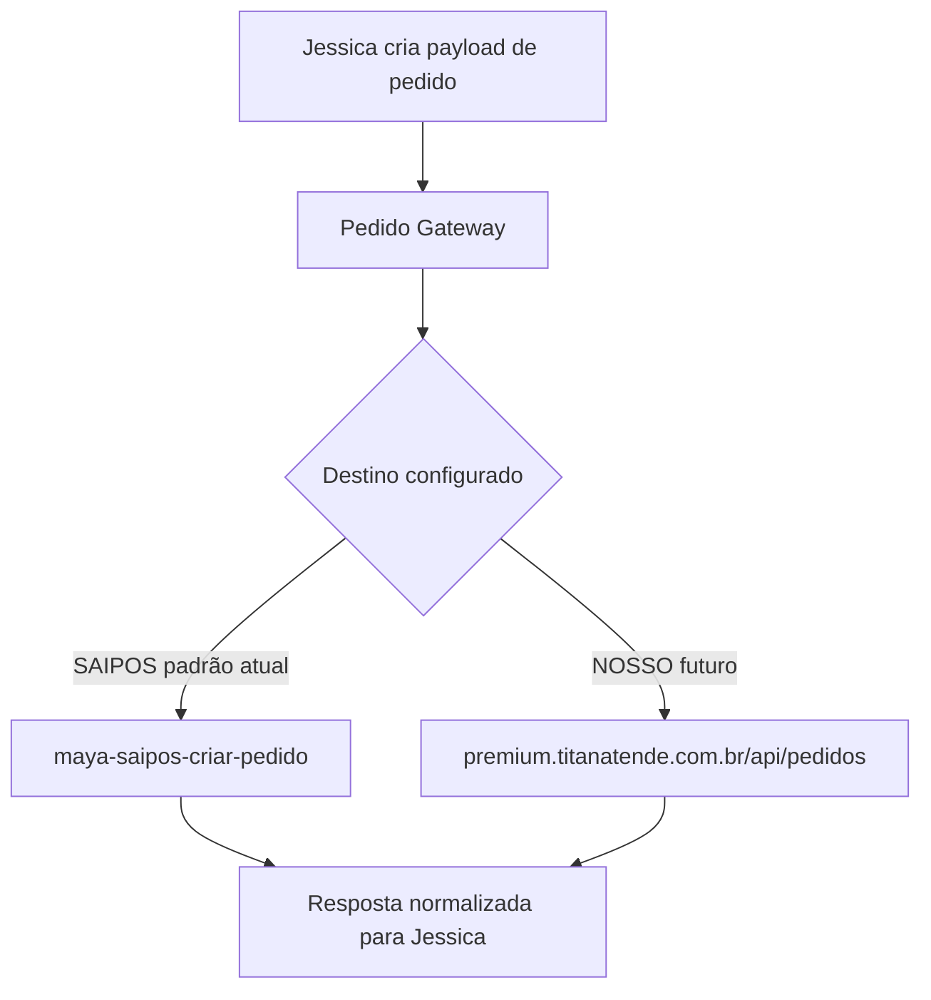
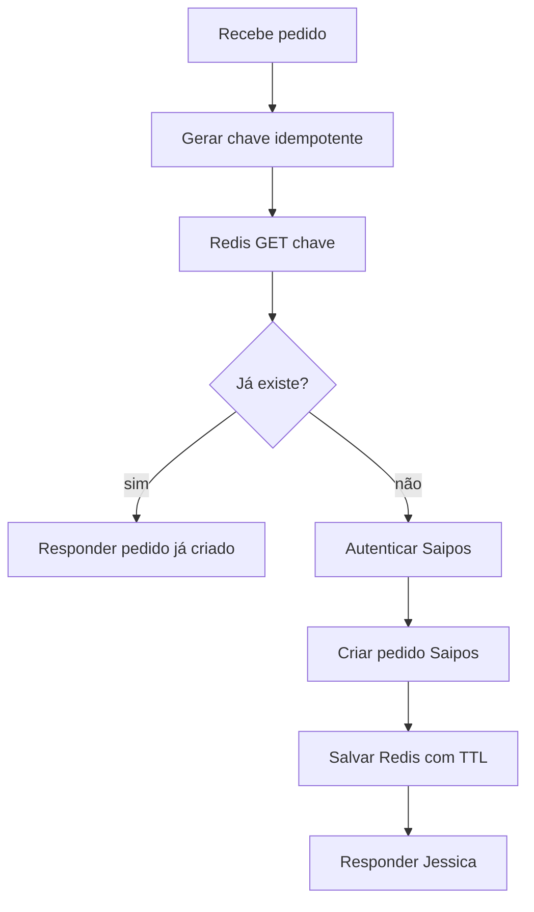
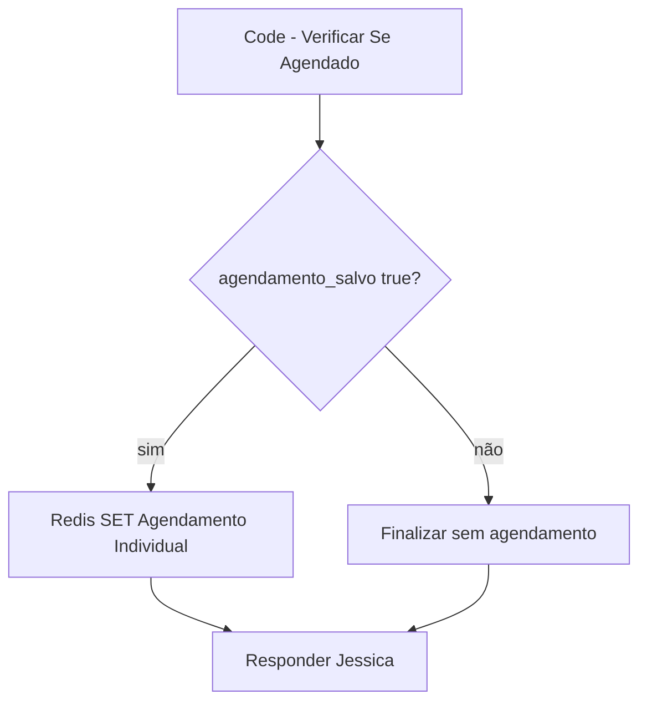

# Saipos, Gateway de Pedido e Blindagem

Data: 2026-06-23  
Autor: Codex  
Escopo: Jessica criando pedidos para Premium Pizzas

## Situação atual

A Jessica chamava diretamente:

```txt
https://webhook.titanatende.com.br/webhook/maya-saipos-criar-pedido
```

Isso deixava o destino fixo em Saipos e dificultava evoluir para:

- Saipos como destino principal atual.
- Plataforma própria Titan como destino alternativo.
- iFood/Delivery Direto como fontes de pedido.
- Auditoria e idempotência antes de criar pedido real.

## Alteração criada

Foi criado o workflow:

```txt
PROD - Titan Khardela - Pedido Gateway Premium v1
workflowId: lZEl4AUUCE2xUElC
endpoint: /webhook/khardela/pedido-gateway/premiumpizzas-sjrp
```

Destino padrão:

```txt
SAIPOS
```

Endpoint público:

```txt
https://webhook.titanatende.com.br/webhook/khardela/pedido-gateway/premiumpizzas-sjrp
```

## Como o gateway funciona

Entrada da Jessica:



Por enquanto, se nenhum destino for informado, o gateway envia para Saipos.

Se receber `destino_pedido: "NOSSO"`, tenta enviar para a API própria da loja. Esse caminho está preparado, mas ainda depende do mapeamento completo de itens para `/api/pedidos`.

## Por que isso é melhor

- A Jessica deixa de conhecer o destino final.
- O Command poderá escolher destino por cliente/tenant.
- Saipos continua principal sem quebrar o fluxo.
- Fica possível testar Nossa Loja sem alterar o prompt da Jessica.
- Fica possível adicionar idempotência, auditoria e fallback antes do destino.

## Blindagem necessária no fluxo Saipos

### 1. Idempotência antes da Saipos

Hoje o fluxo salva dados no Redis depois de criar o pedido. O ideal é consultar antes:



Chaves sugeridas:

```txt
pedido:idempotency:{tenant}:{order_id}
pedido:idempotency:{tenant}:{telefone}:{hash_carrinho}
```

TTL sugerido:

```txt
48h a 7 dias
```

### 2. Agendamento com IF explícito

Hoje o fluxo verifica se é agendado e segue para `Redis SET Agendamento Individual`. Para evitar tentativa de salvar chave vazia, precisa ficar assim:



### 3. Resposta correta para webhook

O webhook Saipos deve responder com o JSON da etapa `Code - Resposta para Maya`, não com o retorno técnico do último Redis.

Correção recomendada:

- Trocar `responseMode` para `responseNode`.
- Adicionar `Respond to Webhook` depois da resposta normalizada.
- Manter Redis/incrementos como side effects.

### 4. Erro seguro

Em qualquer erro da Saipos:

- Não criar pedido duplicado.
- Retornar `ok:false`.
- Registrar `tenant`, `order_id`, `telefone`, `hash_carrinho`, `etapa`.
- Não registrar segredo/token.
- Jessica deve dizer que vai confirmar com a equipe, sem inventar pedido.

### 5. Schema da tool da Jessica

A tool `criar_pedido` precisa aceitar:

- `payment_types` para múltiplos pagamentos.
- `total_discount`.
- `total_increase`.
- `order_id`.
- `display_id`.
- `delivery_by`.
- `scheduled`.
- `delivery_date_time`.

## Próxima implementação recomendada

1. Testar o gateway com pin data, sem criar pedido real.
2. Atualizar a tool `criar_pedido` da Jessica para apontar ao gateway.
3. Só publicar a Jessica após comparar rascunho vs versão ativa, porque há divergência de versão no AI Agent.
4. Blindar o workflow Saipos com idempotência antes da chamada externa.
5. Corrigir resposta/agendamento.
6. Rodar homologação Saipos controlada.

## Estado atual após esta rodada

- Gateway criado e publicado.
- Saipos continua sendo o destino principal.
- Teste seguro manual realizado com `destino_pedido: NOSSO` e sem itens; o gateway retornou erro controlado `payload_sem_itens_para_loja_propria` sem chamar Saipos nem loja.
- AI Agent ainda exige cuidado antes de publicar, pois possui rascunho diferente da versão ativa.
